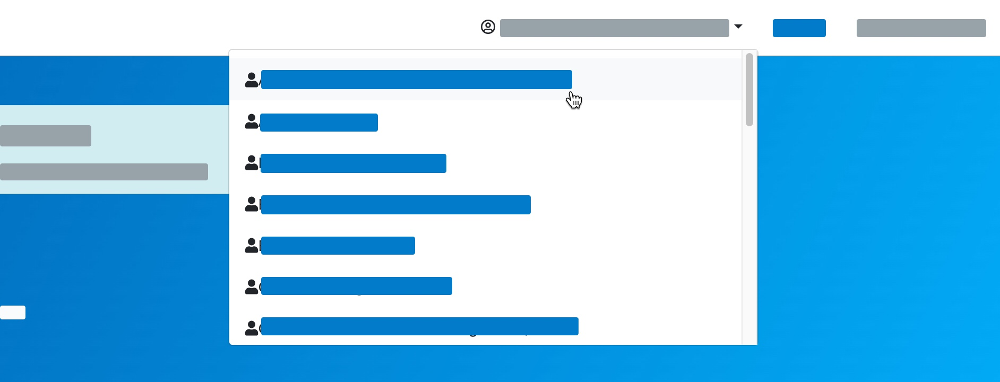
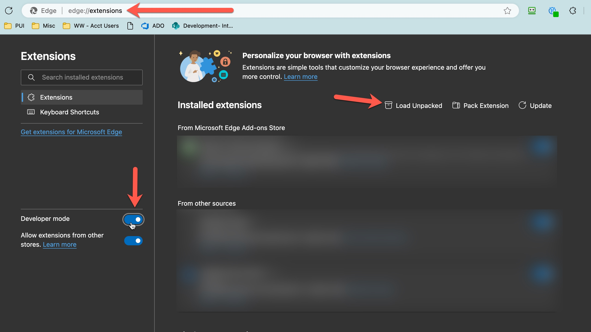
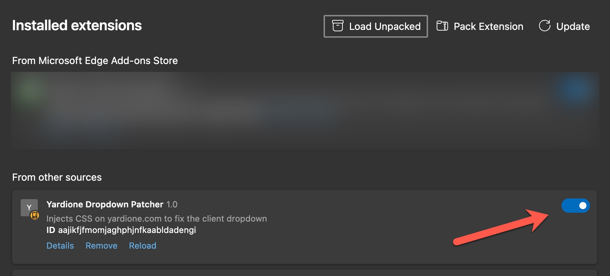

# Y1-Dropdown-Patcher
Corrects the YardiOne Client Select dropdown to have a scroll bar instead of spilling off the page.

IYKYK 🤷‍♀️

### Before

### After

## Installation
- [Download the 1.0 zip file.](https://github.com/salempeake/Y1-Dropdown-Patcher/releases/tag/1.0)
- Unzip somewhere it's not likely to get modified, like your user folder
- Open Edge/Chrome and go to the extensions path
- Enable Developer Mode
- Click "Load Unpacked" and select the folder
- You should now have the YardiOne Dropdown Patcher v1, just make sure the switch is enabled.

## Disclaimer
This extension is provided as-is, without any warranty or guarantee of its functionality or performance. I do not offer support for this extension, and its operation may be affected if the target web page undergoes changes or updates. The user acknowledges and accepts all risks associated with the use of this extension.
